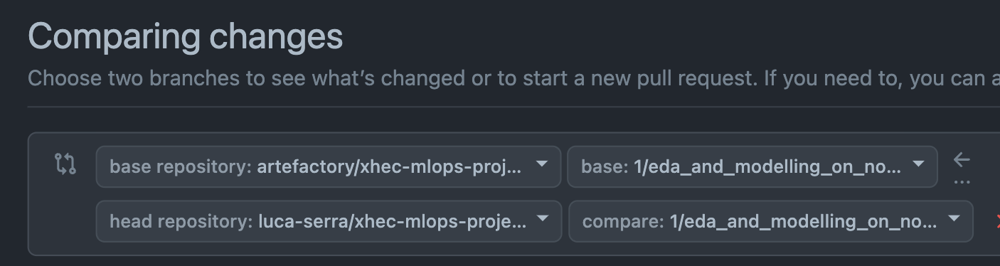

<div align="center">

# xhec-mlops-project-student

[](https://github.com/artefactory/xhec-mlops-project-student/actions/workflows/ci.yaml?query=branch%3Amaster)
[]()

[](https://github.com/psf/black)
[](https://pycqa.github.io/isort/)
[](https://github.com/astral-sh/ruff)
[](https://github.com/artefactory/xhec-mlops-project-student/blob/main/.pre-commit-config.yaml)
</div>

This repository has for purpose to industrialize the [Abalone age prediction](https://www.kaggle.com/datasets/rodolfomendes/abalone-dataset) Kaggle contest.


The age of abalone is determined by cutting the shell through the cone, staining it, and counting the number of rings through a microscope -- a boring and time-consuming task. Other measurements, which are easier to obtain, are used to predict the age.


**Goal**: predict the age of abalone (column "Rings") from physical measurements ("Shell weight", "Diameter", etc...). Here in notebook EDA and modelling, we know that the target is Age of abalone however we need to convert column "Rings" by + 1.5 to get real target value "Age"

You can download the dataset on the [Kaggle page](https://www.kaggle.com/datasets/rodolfomendes/abalone-dataset) 

Please make sure you have created a file "data" after you cloned this repository and save the downloaded data set from kaggel as "abalone.csv" if you are trying to acheive something that need the training data set such as the topics mentioned in branch 1, 2, and 3

# XHEC MLOPS Project Student

This document provides instructions for setting up and using the Abalone age prediction model.

## Environment Setup

Ensure you are in the right environment. Set it up using the provided `environment.yml` file.

## Model Training for Online Prediction

Before you can run predictions, you need to:
1. Train the model by switch to src/modeling. After executing following code, access the website: http://0.0.0.0:4200
```bash
prefect config set PREFECT_API_URL=http://0.0.0.0:4200/api
prefect server start --host 0.0.0.0
python main.py
```
3. Save the trained model as `model.pkl` and the data vectorizer as `dv.pkl`.

Both files should be stored in the `web_service/local_objects` directory.

## Docker Build & Run

Once the model and vectorizer are saved, you can build and run the docker image:

```bash
docker build -t abalone:solution -f Dockerfile.app .
docker run -p 8000:8001 abalone:solution
```

After that, you should be able to make prediction by indicating the features. Note that for "Sex", we have three options: "I" "M" "F" in 

http://localhost:8000/docs

</details>

## Table of Contents

- [xhec-mlops-project-student](#xhec-mlops-project-student)
  - [Table of Contents](#table-of-contents)
  - [Deliverables and notation](#deliverables-and-notation)
    - [Deliverables](#deliverables)
    - [Notation](#notation)
  - [Steps to reproduce to build the deliverable](#steps-to-reproduce-to-build-the-deliverable)
    - [Pull requests in this project](#pull-requests-in-this-project)
    - [Tips to work on this project](#tips-to-work-on-this-project)

## Deliverables and notation

### Deliverables

The deliverable of this project is a copy of this repository with the industrialization of the Abalone age prediction model.
The industrialization takes the form of an API (which runs locally) that can be used to make predictions on new data.

### Evaluation

Your work will be graded based on the following criteria:

- **Clarity** and quality of code 
  - good module structure
  - naming conventions
  - correct docstrings, formatting, type hints (the code should be linted and formatted)
- **Reproducibility** and clarity of instructions to run the code (we will actually try to run your code)
  - Having a clear README.md with the steps to reproduce to test the code
  - Having a working docker image with the required features (see bellow)
  - Having clear instructions to re-create the Python environment
- Having the following **features** in your project
  - Clear README with:
    - context of the project
    - clear steps to reproduce to run the code
  - A working API which can be used to make predictions on new data
    - The API can run on a docker container
    - The API has validation on input data (use Pydantic)
  - The code to get the trained model and encoder is in a separate module and must be reproducible (not necessarily in a docker container)
  - The workflows to train the model and to make the inference (prediction of the age of abalone) are in separate modules and use Prefect `flow` and `task` objects
- Use of *Pull Requests* (see below) to coordinate your collaboration 

## Steps to reproduce to build the deliverable

To help you with the structure and order of steps to perform in this project, we created different pull requests templates. 
Each branch in this repository corresponds to a future pull request and has an attached markdown file with the instructions to perform the tasks of the pull request.
Each branch starts with a number.
You can follow the order of the branches to build your project and collaborate.

> [!NOTE]
> There are "TODO" in the code of the different branches. Each "TODO" corresponds to a task to perform to build the project.

**Please follow these steps**:

- If not done already, create a GitHub account
- If not done already, create a [Kaggle account](https://www.kaggle.com/account/login?phase=startRegisterTab&returnUrl=%2F) (so you can download the dataset)
- Fork this repository (one person per group)

**WARNING**: make sure to **unselect** the option "Copy the `master` branch only", so you have all the branches in the forked repository.

- Add the different members of your group as admin to your forked repository
- Follow the order of the numbered branches and for each branch:
  - Read the PR_i.md (where i is the number of the branch) file to understand the task to perform
   > [!NOTE]
   > Dont forget to integrate your work from past branches (except for when working on branch #1 obviously (!))
   > ```bash
   > git checkout branch_number_i
   > git pull origin master
   > # At this point, you might have a VIM window opening, you can close it using the command ":wq" 
   > git push
   > ```
    - Do as many commits as necessary on the branch_number_i to perform the task indicated in the corresponding markdown file
    - Open a pull request from this branch to the main branch of your forked repository
    - Once done, merge the pull request in the main branch of your forked repository

### Pull requests in this project

Github [Pull Requests](https://docs.github.com/articles/about-pull-requests) are a way to propose changes to a repository. They have for purpose to integrate the work of *feature branches* into the main branch of the repository, with a collaborative review process.

**PR tips:**

Make sure that you select your own repository when selecting the base repository:



It should rather look like this:


### Tips to work on this project

- Use a virtual environment to install the dependencies of the project (conda or virtualenv for instance)

- Once your virtual environment is activated, install pre-commit hooks to automatically format your code before each commit:

```bash
pip install pre-commit
pre-commit install
```

This will guarantee that your code is formatted correctly and of good quality before each commit.

- Use a `requirements.in` file to list the dependencies of your project. You can use the following command to generate a `requirements.txt` file from a `requirements.in` file:

```bash
pip-compile requirements.in
```
